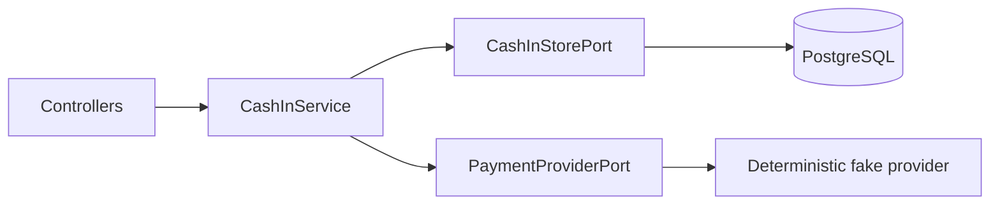

# Wallet Cash-In Service

A focused NestJS service demonstrating multi-pod idempotency, safe wallet credits, uncertain payment handling, and authenticated webhooks. PostgreSQL—not process memory or a distributed lock—is the financial authority.

## Quick start

Requirements: Node.js 24+, npm, and Docker Compose.

```bash
npm ci
docker compose -f compose.test.yaml up -d --wait
npm run migration:run:test
npm run test:all
```

Set `DATABASE_URL` and `WEBHOOK_SECRET` before `npm run start:dev`. Tear down tests with `docker compose -f compose.test.yaml down -v`.

## HTTP contracts

### `POST /cash-in`

Requires `Idempotency-Key: <UUID>`.

```json
{
  "user_id": "usr_abc123",
  "amount": 100.00,
  "currency": "PEN",
  "payment_method": "fake_success"
}
```

| Result | HTTP | Meaning |
|---|---:|---|
| `completed` | 200 | Confirmed once; stored balance is replayable |
| `awaiting_confirmation` | 202 | Provider outcome is unknown; no blind second charge |
| `failed` | 422 | Confirmed rejection; stable error is replayed |
| key conflict | 409 | UUID belongs to another normalized request |

The challenge's numeric `amount` contract is supported from `0.01` through `1,000,000.00`; exact decimal strings are also accepted as an extension. This bound keeps conversion to integer cents exact after numeric normalization. Values with fractional cents or above the maximum return `400`. `amount` and `new_balance` are numeric while their stored cents fit JavaScript's safe-integer range. If an out-of-scope accumulated balance exceeds that range, the serializer returns exact decimal text rather than a rounded number.

The deterministic fake accepts `fake_success`, `fake_decline`, `fake_timeout`, and test-controlled `fake_delayed`. These are test scenarios, not a production provider contract.

### `POST /webhooks/payment`

Requires `X-Webhook-Signature`, a hexadecimal HMAC-SHA256 of the exact raw body using `WEBHOOK_SECRET`.

```json
{
  "event_id": "evt_1",
  "operation_id": "1e049f36-90e7-4bf8-a8f3-31efad401fd8",
  "type": "payment.succeeded",
  "sequence": 2,
  "provider_payment_id": "pay_1"
}
```

The supported event types are `payment.succeeded` and `payment.failed`; failure events may include `failure_code`. Valid identical duplicates and old events receive `202`. Reusing an event ID with changed immutable identity returns `409`. Invalid signatures receive `401` before business processing.

`sequence` accepts safe positive JSON integers for convenience. Values above `Number.MAX_SAFE_INTEGER` must be sent as decimal digit strings so the signed raw payload remains exact. The maximum is PostgreSQL `BIGINT` (`9223372036854775807`); unsafe numeric literals and larger strings return `400` instead of being rounded.

## Architecture



This is pragmatic Hexagonal Architecture. Ports exist only for volatile persistence and provider boundaries. There is no generic repository, command bus, CQRS layer, or framework-level Saga.

## Correctness model

### Idempotency and multiple pods

The request becomes integer minor units and fixed-field canonical data, then SHA-256. `INSERT ... ON CONFLICT DO NOTHING` against the unique key elects exactly one provider-call owner. Replays compare fingerprints before provider access. Unique constraints protect provider request, ledger operation, and provider event IDs.

### Money and concurrency

Persisted money uses `BIGINT`, and each Cash-In is bounded to `1,000,000.00`. Successful finalization locks the operation, inserts its unique ledger entry, atomically upserts `wallets.balance_minor = current + credit`, stores the resulting balance, and completes the operation in one transaction. Provider calls never occur inside it. PostgreSQL deadlock/serialization failures receive one bounded retry. The response serializer preserves the challenge's numeric fields for all safe accumulated balances and deterministically falls back to exact decimal text if a balance ever exceeds safe JavaScript cents.

### Unknown outcomes

A timeout or thrown transport error is `AWAITING_CONFIRMATION`, not failure. Retries receive the same operation, perform one bounded idempotent status lookup, and do not create a new provider request. A `CREATED` operation left by a restart can be claimed atomically; a `PAYMENT_REQUESTED` operation is reconciled rather than blindly charged. If a provider offers neither idempotent requests nor canonical lookup, no service can guarantee both availability and no duplicate external charge; this service chooses safety and waits for reconciliation.

### Webhooks

HMAC verification uses the raw body. Events are serialized, persisted once, and compared with the latest operation sequence and immutable identity fields. Duplicate IDs are acknowledged only when operation, provider payment, type, sequence, and payload hash match. Older sequences are retained as ignored. Success shares the synchronous transactional finalizer; confirmed failure moves `PAYMENT_REQUESTED` or `AWAITING_CONFIRMATION` to `FAILED`. Terminal states cannot be rewritten by contradictory late events.

## Database and configuration

- TypeORM owns connections/migrations; parameterized SQL protects critical invariants.
- `synchronize: false` is mandatory.
- Zod 4 validates configuration at bootstrap.
- The explicit migration is tested up/down/up.
- `.env.example` contains placeholders only. Production requires explicit `DATABASE_URL` and `WEBHOOK_SECRET`; defaults exist only for development/test.

## Verification

| Suite | Command | Boundary |
|---|---|---|
| Unit | `npm run test:unit` | states, money, fingerprint |
| Integration | `npm run test:integration` | migration and real PostgreSQL concurrency |
| E2E | `npm run test:e2e` | HTTP, multi-instance arbitration, provider, webhook |
| Coverage | `npm run test:cov` | diagnostic unit coverage |
| Quality | `npm run format:check && npm run lint && npm run build` | static gates |

Database suites use Vitest `--no-file-parallelism`; `--runInBand` is an unsupported Jest option.

## Guarantees and limitations

Guaranteed locally: one owner per key across pods, one ledger credit per operation, lost-update-safe balance changes, terminal/uncertain replay, and authenticated duplicate/order-aware webhooks.

Not claimed: distributed exactly-once charging by an arbitrary provider, refunds, chargebacks, FX, reconciliation scheduling, production provider networking, metrics export, or load testing.

Redis may later be a cache/duplicate shield, never the financial authority. Saga becomes relevant only if Payment and Wallet become autonomous services with durable messaging and real compensation. Broker/outbox is deferred until cross-service delivery exists.

## Defense notes

- Multi-pod ownership is arbitrated by PostgreSQL, not memory. The e2e harness uses five same-process Nest application instances to approximate independent pods; the database constraint and transactional claim are the actual cross-process invariant.
- Timeout preserves uncertainty because a new provider key could charge twice.
- Ledger uniqueness protects credit regardless of webhook delivery count.
- At one million operations/day, evaluate partitioning/retention, pool budgets, async reconciliation, outbox, rate limits, and measured cache pressure.

Review [`docs/tdd-evidence.md`](docs/tdd-evidence.md), [`docs/ai-assistance.md`](docs/ai-assistance.md), and [`docs/challenge.md`](docs/challenge.md).
