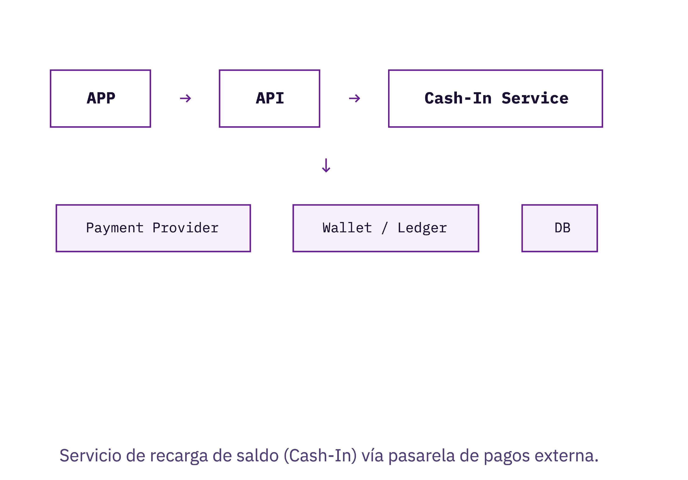
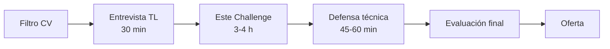

# Challenge Técnico - Senior Backend Developer

**Wallet Cash-In - Idempotencia, Concurrencia y Pilotaje IA**  
**Ligo Tech - Equipo B2C**  
**Agosto de 2026**

> **Nota de procedencia y fidelidad:** este documento es una transcripción estructurada del PDF original, compuesto por 15 páginas rasterizadas sin capa de texto. Se preservaron el contenido, los contratos, los criterios de evaluación y el sentido de los diagramas. El diagrama de contexto se conserva como imagen para no inferir conexiones que el original no explicita; el proceso lineal se representa en Mermaid.

## Contenido

1. [Cómo evaluamos este challenge](#cómo-evaluamos-este-challenge)
2. [Contexto del problema](#contexto-del-problema)
3. [Endpoint y contrato](#endpoint-y-contrato)
4. [Escenarios que debe contemplar la solución](#escenarios-que-debe-contemplar-la-solución)
5. [Pregunta central](#pregunta-central)
6. [Entregables obligatorios](#entregables-obligatorios)
7. [README obligatorio](#readme-obligatorio---qué-debe-explicar)
8. [Tiempo y alcance](#tiempo-y-alcance)
9. [Rúbrica de evaluación](#rúbrica-de-evaluación)
10. [Resultado esperado](#resultado-esperado)
11. [Red flags](#red-flags)
12. [Defensa técnica](#defensa-técnica---preguntas)
13. [Proceso](#proceso)
14. [Cierre](#cierre)

## Cómo evaluamos este challenge

Puedes (y debes) usar un agente de IA (Kiro, Cursor, Copilot, etc.) para construir la solución.

1. No evaluamos cuánto código escribiste a mano.
2. Evaluamos las specs que le diste al agente.
3. Evaluamos qué corregiste cuando el agente se equivocó.

Un agente de IA puede generar una solución de idempotencia ingenua (ej. variable en memoria). Un Senior lo detecta y lo corrige. **Eso es lo que buscamos.**

## Contexto del problema

Servicio de recarga de saldo (Cash-In) vía pasarela de pagos externa.



## Endpoint y contrato

### Solicitud

- **Método y ruta:** `POST /cash-in`
- **Header:** `Idempotency-Key` (`UUID`)

```json
{
  "user_id": "usr_abc123",
  "amount": 100.00,
  "currency": "PEN",
  "payment_method": "card_xyz"
}
```

### Respuesta exitosa

- **Estado HTTP:** `200 OK`

```json
{
  "operation_id": "op_9f8e7d",
  "status": "completed",
  "amount": 100.00,
  "new_balance": 350.00
}
```

## Escenarios que debe contemplar la solución

- Doble click del usuario.
- Retry automático de la app.
- Múltiples pods concurrentes.
- Timeout del proveedor.
- Webhook duplicado.
- Webhook fuera de orden.
- Webhook antes que la respuesta del API.
- Fallo temporal de DB.
- Reinicio del servicio durante la operación.
- Race condition sobre el saldo.

## Pregunta central

> El proveedor cobra S/100. Antes de responder, ocurre un timeout. No sabes si el cobro se realizó. El cliente reintenta.
>
> **¿Cómo evitas cobrar dos veces?**

No hay una única respuesta correcta. Evaluamos el razonamiento.

## Entregables obligatorios

- `POST /cash-in` y `POST /webhooks/payment`.
- Idempotencia real (multi-pod).
- Máquina de estados de la operación.
- Manejo de webhooks duplicados y fuera de orden.
- Tests mínimos: idempotencia, duplicidad, éxito, fallo del proveedor.
- README con arquitectura y decisiones.

## README obligatorio - Qué debe explicar

### Secciones del README

- Arquitectura propuesta.
- Estrategia de idempotencia.
- Manejo de concurrencia.
- Estrategia de retry.
- Manejo de webhooks.

### Sección clave

Qué le pediste al agente de IA (specs/prompts) y qué tuviste que corregir o rediseñar tú mismo.

## Tiempo y alcance

**3-4 horas**

Preferimos una solución pequeña, bien diseñada y bien explicada sobre una plataforma completa.

## Rúbrica de evaluación

| Área | Peso |
|---|---:|
| Diseño / arquitectura y criterio técnico | 20% |
| Idempotencia y concurrencia | 20% |
| Pilotaje del agente IA (specs claras, validación crítica del output) | 15% |
| Calidad de código y testing | 15% |
| Manejo de errores / resiliencia | 15% |
| Persistencia y modelado de datos | 5% |
| Observabilidad (trace/correlation ID) | 5% |
| README / comunicación de decisiones | 5% |

> **Nota:** Idempotencia/concurrencia y pilotaje IA no deben bajar del 60% de su propio peso, sin importar el puntaje total.

## Resultado esperado

| Puntaje | Resultado |
|---:|---|
| 85-100 | Senior fuerte |
| 75-84 | Senior |
| 65-74 | Revisar como Semi Senior |
| <65 | No cumple seniority |

**Mínimo para avanzar: 75/100.**

## Red flags

- Idempotencia solo con variable en memoria.
- No considera múltiples pods.
- Acepta el código del agente sin cuestionar su arquitectura.
- No puede explicar por qué el agente propuso algo.
- Retry indiscriminado sobre operaciones financieras.
- Confía en que los webhooks llegan una sola vez.
- No escribe pruebas.

## Defensa técnica - Preguntas

- "5 pods reciben el mismo Idempotency-Key simultáneamente, ¿qué garantiza que solo uno procese la operación?"
- "¿Qué le pediste al agente que no resolvió bien? ¿Cómo lo corregiste?"
- "¿Cuándo usarías Redis vs base de datos para idempotencia?"
- "¿Qué cambiarías si este servicio procesara 1 millón de operaciones al día?"

## Proceso



## Cierre

**Buscamos criterio técnico, no líneas de código.**

