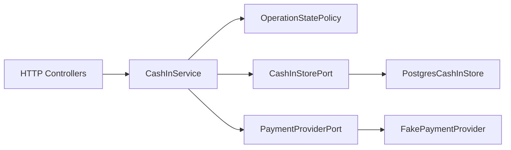
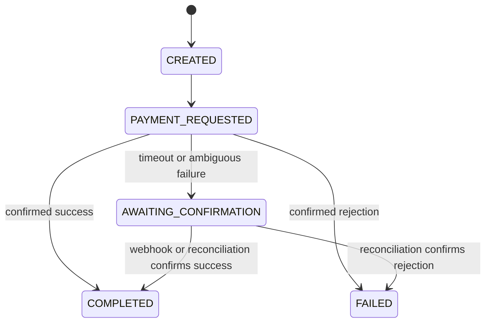

# Wallet Cash-In Implementation Plan

This plan defines a focused implementation for the Senior Backend challenge. It prioritizes financial invariants, distributed idempotency, concurrency tests, and explicit tradeoffs over infrastructure breadth.

## 1. Delivery objective

Build a small NestJS service that:

- exposes `POST /cash-in` and `POST /webhooks/payment`;
- processes the same idempotency key safely across multiple pods;
- prevents duplicate wallet credits;
- handles uncertain provider timeouts without blind retries;
- tolerates duplicate and out-of-order webhooks;
- documents the guarantees, assumptions, limitations, and AI-assisted decisions.

The service does not claim distributed exactly-once delivery. Its guarantees come from database constraints, idempotent transitions, and provider reconciliation capabilities.

## 2. Architectural decision

Use a **pragmatic Hexagonal Architecture** contained in one NestJS feature module.



### Boundaries

| Boundary | Responsibility |
|---|---|
| HTTP controllers | Validate transport input and map application results to HTTP responses |
| `CashInService` | Orchestrate the use case without persistence or provider-specific details |
| `OperationStatePolicy` | Define valid state transitions as pure domain logic |
| `CashInStorePort` | Expose atomic persistence operations that protect business invariants |
| `PaymentProviderPort` | Initiate a payment and query its canonical status |
| PostgreSQL adapter | Enforce uniqueness, transactions, ledger integrity, and balance updates |
| Fake provider adapter | Reproduce success, rejection, timeout, and delayed confirmation in tests |

Ports must describe use-case operations rather than generic CRUD repositories.

## 3. Proposed project structure

```text
src/
├── cash-in/
│   ├── application/
│   │   ├── cash-in.service.ts
│   │   └── ports/
│   │       ├── cash-in-store.port.ts
│   │       └── payment-provider.port.ts
│   ├── domain/
│   │   ├── cash-in-operation.ts
│   │   ├── operation-state.ts
│   │   └── operation-state.policy.ts
│   ├── infrastructure/
│   │   ├── persistence/postgres-cash-in.store.ts
│   │   └── payment/fake-payment-provider.adapter.ts
│   ├── presentation/
│   │   ├── cash-in.controller.ts
│   │   ├── payment-webhook.controller.ts
│   │   └── dto/
│   └── cash-in.module.ts
├── database/
│   ├── migrations/
│   └── database.module.ts
└── shared/
    └── observability/
```

Do not introduce additional layers, command buses, domain events, or per-table repository interfaces unless the implementation reveals a concrete need.

## 4. Persistence model

PostgreSQL is the financial source of truth.

### `cash_in_operations`

| Column | Purpose |
|---|---|
| `operation_id` | Internal operation identifier |
| `idempotency_key` | Client key with a unique constraint |
| `request_fingerprint` | SHA-256 of the normalized business request |
| `provider_request_key` | Stable provider-facing idempotency key, unique |
| `user_id` | Wallet owner |
| `amount_minor` | Amount in minor units using `BIGINT` |
| `currency` | Normalized ISO currency code |
| `payment_method` | Provider token or reference |
| `status` | Current operation state |
| `provider_payment_id` | Provider reference when available |
| `completed_balance_minor` | Balance returned by the terminal success response |
| timestamps | Creation and last update times |

### `wallets`

- Composite primary key: `(user_id, currency)`.
- `balance_minor BIGINT`.

### `wallet_ledger`

- `operation_id UNIQUE` prevents duplicate credits.
- Stores the credited amount and resulting balance.

### `provider_events`

- `provider_event_id UNIQUE` deduplicates webhook deliveries.
- Stores the provider reference, event type, ordering metadata, payload hash, and processing status.

## 5. Idempotency flow

1. Validate the request and `Idempotency-Key` UUID.
2. Convert the amount to minor units and normalize the currency.
3. Produce a canonical representation with fixed field order.
4. Calculate a SHA-256 request fingerprint.
5. Attempt to insert the operation with `INSERT ... ON CONFLICT DO NOTHING RETURNING ...`.
6. Only the request that inserted the row may initiate the provider payment.
7. Concurrent requests load the existing operation and compare fingerprints.

### Repeated request behavior

| Existing operation | Response |
|---|---|
| Same fingerprint and `COMPLETED` | Replay the stored successful response |
| Same fingerprint and non-terminal state | Return `202 Accepted` with operation ID and status |
| Same fingerprint and terminal failure | Replay the stored terminal failure |
| Different fingerprint | Return `409 Conflict` without calling the provider |

The idempotency key is not a correlation ID and must not be logged in plain text.

## 6. Operation state machine



Rules:

- terminal states never transition backwards;
- repeating the same terminal transition is a no-op;
- timeout, connection loss, and ambiguous provider `5xx` responses are not definitive failures;
- contradictory terminal events are recorded for reconciliation rather than guessed.

## 7. Provider timeout strategy

Persist `PAYMENT_REQUESTED` and a deterministic `provider_request_key` before the external request. Do not keep a database transaction open during the network call.

When the result is uncertain:

1. transition to `AWAITING_CONFIRMATION`;
2. do not create a new operation;
3. query the provider by merchant reference when supported;
4. retry the payment request only when the provider guarantees idempotency for the same key;
5. otherwise wait for a webhook or require reconciliation.

If the provider offers neither idempotent requests nor canonical status lookup, the service cannot honestly guarantee both availability and absence of duplicate external charges. The safe policy is to avoid blind retries.

## 8. Wallet finalization transaction

Successful provider responses and successful webhooks call the same `finalizeCompleted()` operation.

Within one transaction:

1. lock or atomically validate the operation state;
2. insert the ledger entry with `operation_id UNIQUE`;
3. only when the ledger insert succeeds, increment the wallet balance atomically;
4. transition the operation to `COMPLETED`;
5. store the resulting balance for response replay.

No external network call is allowed inside this transaction.

## 9. Webhook handling

1. Verify provider authenticity according to the adapter contract.
2. Persist the event before processing it.
3. Deduplicate it through `provider_event_id UNIQUE`.
4. Correlate it using the operation ID sent as merchant reference.
5. Apply ordering metadata when the provider supplies a sequence or version.
6. Invoke the same transactional finalization used by the synchronous response.
7. Treat old events as no-ops and contradictory terminal events as reconciliation cases.

This flow supports duplicate delivery, out-of-order delivery, and a webhook arriving before the API receives the provider response.

## 10. Retry policy

### Retry with a limit, exponential backoff, and jitter

- idempotent provider status queries;
- local deadlocks or serialization failures;
- webhook processing protected by event and ledger constraints;
- provider payment requests only when the provider guarantees idempotency with the same key.

### Do not retry

- ambiguous payment requests using a new key;
- confirmed provider rejection;
- validation errors or idempotency conflicts;
- functional `4xx` responses;
- external requests while holding a database transaction;
- unbounded retry loops.

## 11. Observability

Accept or generate `X-Correlation-ID` and propagate it to the provider adapter.

Structured logs should include:

- `correlation_id`;
- `operation_id`;
- hashed idempotency key;
- provider payment and event identifiers;
- previous and next state;
- duration and outcome.

Never log payment tokens, secrets, complete webhook bodies, or raw idempotency keys.

Useful counters include idempotency replays, key conflicts, uncertain operations, duplicate webhooks, completed credits, and provider failures.

## 12. Verification plan

Use Vitest and a real PostgreSQL instance for concurrency and persistence tests.

| Priority | Scenario | Expected invariant |
|---:|---|---|
| 1 | Successful Cash-In | One payment, one ledger entry, one balance increment |
| 2 | Confirmed provider rejection | No ledger entry or balance increment |
| 3 | Five concurrent requests with the same key | One operation and one provider call |
| 4 | Same key with a different payload | `409` and no additional provider call |
| 5 | Provider timeout followed by client retry | Same operation and no blind second charge |
| 6 | Duplicate webhook after timeout | One terminal transition and one credit |
| 7 | Webhook before synchronous response | Late response becomes an idempotent no-op |
| 8 | Concurrent independent operations on one wallet | Correct final balance without lost updates |

Mocks are suitable for provider behavior. They are not sufficient to prove PostgreSQL concurrency guarantees.

## 13. AI assistance record

The README must preserve the actual prompts and corrections made during implementation.

| Prompt | Agent proposal | Risk detected | Human correction | Evidence |
|---|---|---|---|---|
| To be recorded during implementation |  |  |  |  |

Do not invent mistakes after implementation. Capture prompts, rejected proposals, corrections, and the tests that demonstrate each correction as they happen.

## 14. Explicit scope decisions

### Included

- pragmatic Hexagonal Architecture;
- PostgreSQL-enforced idempotency and financial invariants;
- provider port with a deterministic fake adapter;
- state machine and reconciliation state;
- webhook inbox and duplicate protection;
- focused integration and concurrency tests.

### Deferred

| Technology | Decision |
|---|---|
| Redis | Future duplicate shield or terminal-response cache; never the financial authority |
| Saga | Consider only after Payment and Wallet become autonomous services with real compensations |
| Outbox and broker | Add when asynchronous cross-service delivery exists |

### Excluded from this challenge

- Redis distributed locks as the primary idempotency guarantee;
- CQRS or a Saga framework;
- Kafka or RabbitMQ;
- microservice decomposition;
- event sourcing;
- production payment-provider integration;
- Kubernetes and complete observability infrastructure;
- refunds, chargebacks, foreign exchange, and load testing.

## 15. Time-boxed execution plan

| Time | Work unit | Exit condition |
|---|---|---|
| 0:00-0:20 | Contracts, states, schema, and README decision log | Invariants and assumptions are explicit |
| 0:20-1:00 | PostgreSQL setup and migration | Tables and constraints are reproducible |
| 1:00-1:50 | Cash-In flow and idempotency arbitration | Concurrent duplicate requests share one operation |
| 1:50-2:35 | Finalization, uncertain timeout, and webhooks | Both confirmation paths share one transaction |
| 2:35-3:30 | High-value integration and concurrency tests | Required invariants have executable evidence |
| 3:30-3:50 | README and defense preparation | Decisions, limits, and AI corrections are documented |
| 3:50-4:00 | Build, lint, and full test suite | Repository is reproducibly green |

If time is lost, cut abstractions, metrics, and the automated reconciler before cutting database invariants, concurrency tests, or the README.

## 16. Definition of done

- [ ] Both required endpoints are implemented and validated.
- [ ] Idempotency works across independent application instances.
- [ ] Reusing a key with a different request returns a conflict.
- [ ] Provider timeouts produce an explicit uncertain state.
- [ ] Webhooks are authenticated, persisted, deduplicated, and order-aware.
- [ ] Wallet credit is protected by a unique ledger entry and an atomic transaction.
- [ ] Concurrent tests run against PostgreSQL and prove the critical invariants.
- [ ] Logs carry correlation identifiers without leaking sensitive data.
- [ ] README documents architecture, retries, limitations, prompts, and real AI corrections.
- [ ] Redis and Saga are documented as conditional evolution paths rather than unjustified dependencies.
